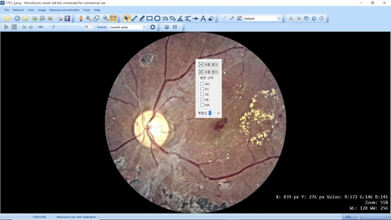

# 의료 AI 증강 유저 인터페이스

의료 영상 뷰어(PACS) 위에 딥러닝 예측 결과를 **오버레이**하여, 별도 화면 전환 없이 원본 영상과 병변 탐지 결과를 동시에 확인할 수 있는 데스크톱 애플리케이션.

| 항목 | 내용 |
|------|------|
| 기간 | 2021.10 ~ 2022.06 |
| 기여도 | 100% (설계 · 모델 학습 · UI 개발) |
| Tech Stack | Python, PyTorch, PyQt |
| 성과 | 📋 특허 등록 (1028946200000) · [학회 논문](https://www.dbpia.co.kr/journal/articleDetail?nodeId=NODE11113701) · 석사 학위논문 |

## 목차

1. [문제 정의](#문제-정의)
2. [작동 방식](#작동-방식)
3. [데모](#데모)
4. [핵심 구현](#핵심-구현)
5. [모델 성능](#모델-성능)

---

## 문제 정의

병원에서 의료 AI를 사용할 때 일반적으로 **PACS 뷰어**(의료 영상)와 **AI 결과 화면**을 번갈아 확인해야 한다. 화면 전환이 잦으면 진료 흐름이 끊기고, 원본 영상과 AI 예측을 직접 대조하기 어렵다.

**해결 방향**: AI 예측 결과를 반투명 레이어로 원본 영상 위에 직접 겹쳐 보여주어, 단일 화면에서 진료와 AI 보조를 동시에 수행할 수 있도록 한다.

## 작동 방식

```
PACS 뷰어 화면
  │
  ├─ ① ROI Detection (YOLOv5)
  │     화면에서 생체 영상 영역을 자동 검출
  │
  ├─ ② Lesion Segmentation (Efficient U-Net)
  │     검출된 ROI에서 병변 픽셀 단위 탐지
  │     (EX · SE · HE · MA 병변 유형별 분류)
  │
  └─ ③ Overlay
        예측 마스크를 반투명 윈도우로 원본 위에 오버레이
```

1. 시스템 트레이 아이콘에서 프로그램 실행
2. **자동 찾기** — YOLO 모델이 화면에서 안저(Fundus) 영상 영역을 자동 검출
3. **병변 선택** — 표시할 병변 유형 선택 (ALL / EX / SE / HE / MA)
4. **투명도 조절** — 오버레이 투명도를 슬라이더로 조절
5. 딥러닝 모델이 병변을 탐지하고, 결과를 원본 영상 위에 오버레이

> **수동 찾기** 모드도 지원: 사용자가 직접 ROI 영역을 드래그하여 지정

## 데모

> 자동 ROI 검출 → 전체 병변(ALL) 오버레이



## 핵심 구현

### 1. ROI Detection — 화면 캡처 기반 YOLOv5

PACS 뷰어에 직접 연동하지 않고, **화면 캡처 → YOLOv5 추론** 방식으로 동작한다. 이 방식 덕분에 특정 PACS 소프트웨어에 종속되지 않고 어떤 뷰어에서든 사용할 수 있다.

학습 데이터는 실제 사용자 화면에 안저 영상을 랜덤 위치·크기로 합성하여 **18,420장**을 생성했다. 모든 YOLOv5 모델이 mAP 99.5%로 동일하여, 사용자가 지연을 체감하지 않도록 가장 빠른 **YOLOv5n (75ms)** 을 선택했다.

### 2. Lesion Segmentation — U-Net 기반 병변 분류

[FGADR](https://csyizhou.github.io/FGADR/) 데이터셋(1,842장, 1280x1280)으로 학습한 U-Net이 안저 영상에서 4가지 병변 유형을 픽셀 단위로 탐지한다. 원본 영상을 640x640으로 리사이즈하여 입력하고, BCE + Dice loss로 학습했다.

| 약어 | 병변 | 시각화 |
|------|------|--------|
| EX | Exudates (경성 삼출물) | 노란색 |
| SE | Soft Exudates (연성 삼출물) | 파란색 |
| HE | Hemorrhages (출혈) | 초록색 |
| MA | Microaneurysms (미세혈관류) | 빨간색 |

### 3. Augmented Overlay — PyQt 투명 윈도우

- PyQt의 `setWindowFlags(Qt.FramelessWindowHint | Qt.WindowStaysOnTopHint)`로 항상 최상위 투명 윈도우 생성
- 오버레이 위치를 ROI 좌표에 정렬하여 원본 영상과 정확히 겹침
- 슬라이더로 투명도 조절 가능

---

## 모델 성능

### ROI Detection (YOLOv5)

모든 모델이 **mAP 99.5%** 로 동일하여 속도 기준으로 모델을 선택했다.

| Model | mAP | Speed |
|-------|-----|-------|
| **YOLOv5n (선택)** | **99.5%** | **75ms** |
| YOLOv5s | 99.5% | 128ms |
| YOLOv5m | 99.5% | 265ms |
| YOLOv5l | 99.5% | 455ms |
| YOLOv5x | 99.5% | 730ms |

### Lesion Segmentation (U-Net)

2-fold cross validation 결과. 배경 대비 병변 영역이 매우 작아 AUC와 Dice를 함께 측정했다.

| Lesion | AUC | Dice |
|--------|-----|------|
| Hard Exudate (EX) | 0.9580 | 0.5514 |
| Soft Exudate (SE) | 0.8739 | 0.2576 |
| Hemorrhage (HE) | 0.9291 | 0.5068 |
| Microaneurysm (MA) | 0.8857 | 0.2261 |

> SE·MA의 Dice가 낮은 이유: 병변 자체가 매우 작아(수 픽셀) 약간의 위치 오차에도 Dice가 급격히 하락한다. AUC 기준으로는 모두 0.87 이상(SE 0.8739).

### 처리 시간

| 단계 | 시간 |
|------|------|
| ROI Detection (YOLOv5n) | ~75ms |
| Lesion Segmentation (U-Net) | ~10.5s |
| **전체 파이프라인** | **~11s** |

> 실험 환경: NVIDIA RTX 3090
