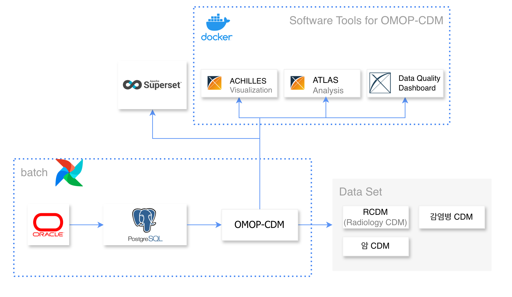
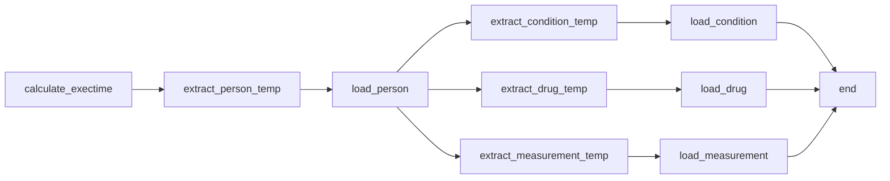
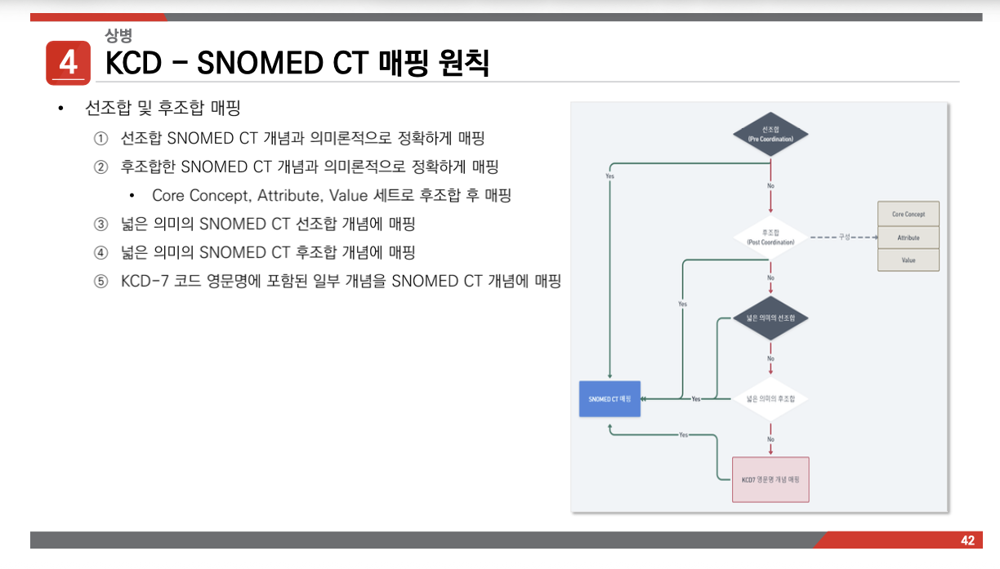

# JBUH OMOP-CDM 구축

전북대학교병원 EMR 데이터를 OHDSI OMOP-CDM v5.4 표준으로 변환하는 ETL 파이프라인을 설계하고 구축한 프로젝트입니다. 용어 표준화, ETL프로세스, 분석환경 구축하는 과정의 내용을 포함하고 있습니다.

### 목차

- [Architecture](#architecture)
- [ETL 주요 과정](#etl-주요-과정)
- [도메인 분류 로직](#도메인-분류-로직)
- [Examples](#examples)
- [Docs](#docs)
- [Lessons Learned](#lessons-learned)

--- 
### 주요 수치

| 항목 | 내용 |
|------|------|
| 데이터 규모 | **2TB** RDBMS 표준화 |
| 표준 용어 매핑 | **15,000건+** (진단·약품·검사·처치 등 전 도메인) |
| 코드 매핑률 | **90%** (의료진 협업을 통한 상병·의약품·검사 용어 매핑) |
| 데이터 품질 | 도메인 맞춤 품질 진단 목록 추가로 **20% 향상** |
| 쿼리 성능 | 복잡 쿼리 최적화 **1일+ → 2시간** |
| 배치 주기 | 월 1회 증분 적재 (Airflow 스케줄링) |


## Architecture




- **Source**: 병원 DW 시스템 (Oracle), 
- **ETL**: Python 기반 추출·변환·적재 스크립트
- **Orchestration**: Apache Airflow를 통한 DAG 스케줄링 및 모니터링
- **Target**: OMOP-CDM v5.4 스키마 (PostgreSQL)
- **Infra**: Docker 기반 데이터 분석 환경 및 대시보드(Superset) 구축
- **데이터마트**: CDM 기반 질환 특화 데이터마트(암 등) 설계 및 연구자용 Superset 대시보드 제공


## ETL 주요 과정

**1. Extract** — Oracle EMR에서 원본 데이터 추출

**2. Transform** — OMOP-CDM 표준 용어(Vocabulary)에 맞게 매핑 및 변환
- 진단 코드(KCD) → SNOMED-CT
- 약품 코드 → RxNorm
- 검사 코드 → LOINC

**3. Load** — 변환된 데이터를 PostgreSQL OMOP-CDM 스키마에 적재



> 상세 DAG 코드: [`examples/dag_example.py`](./examples/dag_example.py)

---


## Examples

### SQL — 원본 → CDM 변환 procedure 예시

```sql
CALL pc_etl_drug_exposure('20100101', '20221231');
;
```


### SQL — 데이터 품질 검증 예시

```sql
-- 원본 대비 CDM 적재 건수 비교
SELECT 'drug_exposure' AS table_name,
       (SELECT COUNT(*) FROM source.prescription
        WHERE order_date >= start_date)    AS source_count,
       (SELECT COUNT(*) FROM cdm.drug_exposure
        WHERE drug_exposure_start_date >= start_date) AS cdm_count;
```

> CDM 변환 SQL (drug_exposure): [`examples/pc_etl_drug_exposure.sql`](./examples/pc_etl_drug_exposure.sql)
> 품질 검증 쿼리 (매핑률, FK 무결성, 날짜 이상값 등): [`examples/quality_check.sql`](./examples/quality_check.sql)
--- 

## 도메인 분류 로직
원본 코드를 OMOP-CDM 테이블(Measurement, Procedure, Drug, Device)에 적재할 때, 2단계 분류 기준을 적용했습니다.

```
1순위: EDI 분류번호 및 EDI 대분류코드 기준으로 도메인 결정
2순위: EDI가 없는 경우 → 원내코드 체계 기반으로 도메인 결정
```

**분류 시 고려한 주요 문제**

- 동일 코드 체계 내에서 접미사에 따라 도메인이 달라지는 케이스 (예: 약제 행위료 vs 약품 자체)
- 급여/비급여 항목 간 분류 기준 차이
- EDI 코드가 누락되거나 분류번호가 없는 예외 데이터 처리

> 실제 매핑 테이블은 병원 내부 코드를 포함하고 있어 공개하지 않습니다.
> 분류 접근 방식에 대한 상세 설명은 [`docs/etl_mapping_guide.md`](./docs/etl_mapping_guide.md)에서 확인할 수 있습니다.


### 용어 표준화를 위한 시행착오

- [`보건의료표준조사.pdf`](docs/보건의료표준조사.pdf) — 국내/국제 표준용어 매핑 프로젝트 소개 발표자료

---

## Docs

### CDM 구축 매뉴얼

OMOP-CDM 구축 전 과정을 정리한 매뉴얼입니다.

1. OMOP-CDM 개요 및 테이블 구조
2. 테이블별 컬럼 매핑 상세 (어떤 원본 값을 어디에 적재했는지)
3. 분석툴(ATLAS, ACHILLES 등) 설치 가이드
4. ETL 코드 실행 방법

> 전체 매뉴얼: [`docs/JBUH_CDM_manual.pdf`](./docs/JBUH_CDM_manual.pdf)


### 코드 매핑 매뉴얼
- [`etl_mapping_guide.md`](./docs/etl_mapping_guide.md) — ETL 매핑 규칙 및 예외 처리 가이드 (일부 발췌)


---

## Lessons Learned

### 증분 적재 전략

과거 데이터가 수정되거나 삭제되는 사례가 있어 실행 기준일 기준 4개월 전부터의 변경 데이터만 추출하는 증분 방식을 적용했습니다. temp 테이블에 먼저 적재한 뒤, 기존 테이블에서 해당 기간 데이터를 삭제하고 INSERT하는 방식으로 데이터 정합성을 유지했습니다.

### EDI 없는 데이터의 도메인 분류

전체 데이터 중 약 15~20%가 EDI 코드가 없는 비급여·원내 자체 항목이었습니다.
이를 처리하기 위해 원내코드 접두사/접미사 패턴 분석을 통한 2차 분류 체계를 설계했고, 심사과 검증을 거쳐 분류 정확도를 확보했습니다.

### 국내/국제 용어 매핑 처리

상병/약품/검사와 같은 도매인별 원내 기관코드와 국내표준용어를 매칭하고 국제 표준용어로 매칭하여 다기관 분석이 가능하도록 대응하였습니다. OHDSI concept_relationship의 Maps to 관계를 기준으로 standard concept을 선택하여 여러 용어체계에 대해서도 분석이 가능하도록 설계했습니다.

---
