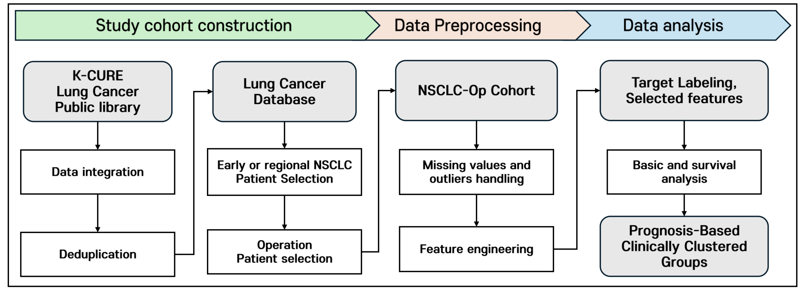
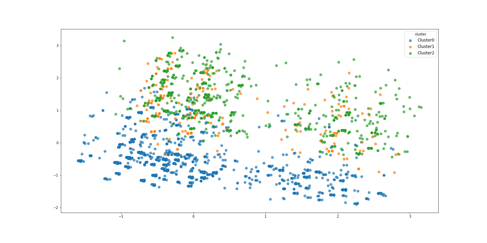

# K-CURE 폐암 생존 분석 — 데이터 통합 및 전처리

제3회 K-CURE 데이터 활용 경진대회에서 **20GB+ 의료 원시 데이터 8개 테이블을 단일 분석 코호트로 통합**하는 데이터 파이프라인을 구축했다. 메모리 제한 VM 환경에서 대용량 SAS 파일을 처리하고, 테이블별로 다른 시간축·구조를 정렬하여 팀의 생존 분석 기반을 마련했다.

| 항목 | 내용 |
|------|------|
| 대회 | 제3회 K-CURE 데이터 활용 경진대회 |
| 수상 | 최우수상 |
| 본인 역할 | 데이터 통합 파이프라인 · 전처리 · EDA · 시각화 |
| Tech Stack | Python, pandas, lifelines, scikit-learn |

## 목차

1. [분석 개요](#분석-개요)
2. [내가 해결한 문제들](#내가-해결한-문제들)
3. [전처리 판단](#전처리-판단)
4. [팀 분석 결과](#팀-분석-결과)

---

## 분석 개요

**목표**: 비소세포폐암 수술 환자의 생존(Overall Survival) 및 이차암 발생을 예측하고 위험 요인 도출

**데이터**: K-CURE 플랫폼 제공 SAS 파일 8종 (건강보험 청구 · 암등록 · 사망 · 건강검진 · 문진)



## 내가 해결한 문제들

### 1. 수천만 행 청구 테이블 — 메모리에 올릴 수 없다

T200(진료)·T300(처방) 테이블은 각각 수천만 행, 총 20GB 이상이다. 대회에서 제공된 VM은 메모리가 제한적이어서 `pd.read_sas()`로 전체 로딩하면 즉시 OOM이 발생했다.

**해결**: chunk 단위 스트리밍으로 읽으면서, 조건에 맞는 행만 필터링하여 CSV로 누적 저장했다.

```python
# T300에서 항암제 처방만 추출 — 전체 로딩 없이 스트리밍
df = pd.read_sas('lc_t300.sas7bdat', chunksize=100000, encoding='cp1252')

for chunk in df:
    filtered = chunk[chunk["GNL_CD"].isin(anticancer_codes)]
    filtered.to_csv(output, mode="a", header=not exists, index=False)
```

항암제 주성분코드 30종(pemetrexed, gefitinib, pembrolizumab 등)은 약물명 기반으로 직접 매핑 테이블을 구성했다.

### 2. 테이블마다 시간축이 다르다 — 단순 merge 불가

환자의 **진단일**과 **건강검진일**은 일치하지 않는다. 단순 `merge(on="SN_KEY")`를 쓰면 매칭이 안 되거나, 진단 이후 검진 결과가 붙는 오류가 생긴다. 임상적으로는 **진단 직전** 검진 결과만 의미가 있다.

**해결**: `merge_asof(direction="backward")`로 진단일 이전 가장 가까운 검진을 매칭했다.

```python
merged = pd.merge_asof(
    registry.sort_values("FDX"),              # 진단일 기준 정렬
    health_exam.sort_values("EXMD_BZ_YYYY"),  # 검진일 기준 정렬
    by="SN_KEY",
    left_on="FDX",
    right_on="EXMD_BZ_YYYY",
    direction="backward"  # 진단일 이전의 가장 가까운 검진
)
```

### 3. 시기별 설문 컬럼이 다르다 — 단순 concat 불가

문진 데이터(g1q)는 3개 시기(07-08, 09-17, 18-23)로 나뉘어 있고, 시기마다 흡연·음주 관련 **컬럼명과 코딩 체계**가 달랐다. 예를 들어 음주 빈도가 `Q_DRK_FRQ_V0108` → `Q_DRK_FRQ_V09N`으로 바뀌어 있었다.

**해결**: 시기별 컬럼을 통일된 이름으로 매핑한 뒤 concat하고, merge_asof로 진단일 기준 매칭했다.

### 최종 통합 결과

| 테이블 | 결합 방식 | 이유 |
|--------|-----------|------|
| `lc_rgst` (암등록) | 기준 테이블 | 환자 1행 = 1레코드 |
| `lc_death` (사망) | left join | 생존 환자는 사망 기록 없음 |
| `lc_g1q_*` (문진 3개) | 컬럼 통일 → concat → merge_asof | 시기별 컬럼명이 다름 |
| `lc_g1e` (검진) | merge_asof(backward) | 진단 직전 검진만 의미 있음 |
| `lc_bfc` (보험료) | merge_asof(nearest) | 연도 기준 근접 매칭 |
| `lc_t200` (진료) | chunk → 수술 필터 → merge | 수천만 행 |
| `lc_t300` (처방) | chunk → 성분 필터 → merge | 수천만 행 |

8개 테이블 → **환자 1명 = 1행** 코호트 데이터셋 완성.

## 전처리 판단

일괄 대치 대신 변수의 **임상적 의미**에 따라 전략을 구분했다.

| 변수 유형 | 전략 | 이렇게 한 이유 |
|-----------|------|----------------|
| 바이오마커 (HGB, FBS 등) | 성별·연령·BMI 그룹 중앙값 | 혈액 수치는 성별·연령대에 따라 정상 범위가 다름 — 전체 중앙값은 왜곡 위험 |
| 범주형 (문진 항목) | MICE (IterativeImputer) | 흡연·음주·운동 간 상관이 있어 변수 간 관계를 활용한 대치가 적절 |
| 소변검사 | 0 (음성) 대치 | 검사 미시행 = 이상 소견 없음으로 판단 (임상 관행) |
| BMI / 암 형태코드 누락 | 행 삭제 | 분석 핵심 변수라 추정값 사용이 부적절 |

```python
# 성별·연령·BMI 그룹별 중앙값 → 전체 중앙값 (2단계 fallback)
for col in biomarker_cols:
    group_median = df.groupby(["SEX", "AGE_GRP", "BMI_GRP"])[col].transform("median")
    df[col] = df[col].fillna(group_median)
    df[col] = df[col].fillna(df[col].median())
```

## 팀 분석 결과

내가 구축한 코호트 데이터를 기반으로 팀에서 수행한 분석:

- **Cox PH 생존 분석** — L2 정규화, 효과 크기 상위 변수 선택, Concordance index 평가
- **클러스터링** — K-Means · K-Modes로 생존 패턴이 다른 환자 하위 그룹 도출



- **ML 모델** — XGBoost, Random Forest, Neural Network로 생존 여부 분류 및 변수 중요도 확인

---

## 코드

본인 담당 부분(데이터 통합 파이프라인)을 정리한 코드:

```
examples/
└── data_pipeline.py    # 8개 테이블 통합 파이프라인 (chunk 스트리밍, merge_asof, 컬럼 통일, 결측 처치)
```
